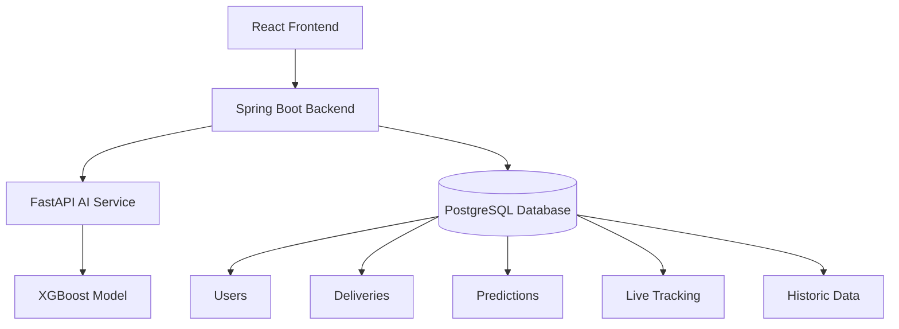

<div align="center">

# 🚚 DeliverAI Guard 🤖

### AI-Powered Delivery Failure Prediction & Real-Time Logistics Monitoring Platform


---


</div>

---

# 📌 Overview

DeliverAI Guard is a **production-oriented AI logistics platform** designed for companies like **Amazon, Blinkit, Zepto, Swiggy, and logistics providers** to predict delivery failures in real time and monitor operational risks efficiently.

The platform combines:

- 🤖 Machine Learning Prediction
- ⚡ Real-Time Monitoring
- 🔐 Secure Authentication
- 📡 WebSocket Communication
- ☁️ Cloud Deployment
- 🐳 Dockerized Architecture

---

# 🧠 AI Features

<table>
<tr>
<td width="50%">

### 🚀 Prediction System
- XGBoost-based ML model
- Delivery risk classification
- SHAP explainability
- FastAPI inference engine
- Multi-feature prediction pipeline

</td>

<td width="50%">

### 📊 Risk Levels
- 🟢 LOW
- 🟡 MEDIUM
- 🔴 HIGH

Real-time prediction monitoring for delivery operations.

</td>
</tr>
</table>

---

# 🏗️ System Architecture



---

# ⚙️ Tech Stack

<div align="center">

| Frontend | Backend | AI/ML | Database | DevOps |
|---|---|---|---|---|
| React + Vite | Spring Boot | FastAPI | PostgreSQL | Docker |
| Axios | Spring Security | XGBoost | JPA/Hibernate | Railway |
| STOMP.js | JWT Auth | SHAP | SQL | Vercel |
| WebSocket | REST APIs | Scikit-learn | | GitHub |

</div>

---

# 📡 Real-Time Features

```text
✅ Live Delivery Monitoring
✅ Real-Time WebSocket Updates
✅ Instant Risk Broadcasting
✅ AI-Based Delivery Predictions
✅ Historic Delivery Analytics
```

---

# 🔐 Security Features

- JWT Authentication
- BCrypt Password Encryption
- Protected REST APIs
- Secure Backend Authorization
- CORS Protected Architecture

---

# 🐳 Dockerized Microservices

```yaml
Frontend Container
Spring Boot Backend Container
FastAPI AI Service Container
PostgreSQL Container
```

---

# ☁️ Cloud Deployment

| Service | Platform |
|---|---|
| Frontend | Vercel |
| Backend | Railway |
| AI Service | Railway |
| PostgreSQL | Railway |

---

# 📂 Project Structure

```bash
deliverai-guard/
│
├── Frontend/
│
├── deliverai-backend/
│
├── AI_Layer/
│
└── docker-compose.yml
```

---

# 📈 Future Enhancements

- 🔄 Automated Model Retraining
- 📍 GPS Live Tracking
- ☸️ Kubernetes Deployment
- 📊 Advanced Analytics Dashboard
- ⚡ Kafka Event Streaming
- 🤖 Ensemble AI Models
- 📉 Drift Detection System

---

# 🖥️ Local Setup

## Clone Repository

```bash
git clone https://github.com/YOUR_USERNAME/deliverai-guard.git
```

---

## Run Docker

```bash
docker-compose up --build
```

---

# 🌟 Project Goal

DeliverAI Guard demonstrates how:

> AI + Backend Engineering + Real-Time Systems + Cloud Deployment

can solve real-world delivery and logistics challenges at scale.

---

<div align="center">

## 👨‍💻 Developed By

### Pratik Pokhrel

<a href="https://github.com/prateekpokhrel">

</a>

<a href="https://www.linkedin.com/in/pokhrelpratik/">

</a>

---

### ⭐ If you like this project, give it a star ⭐

</div>
